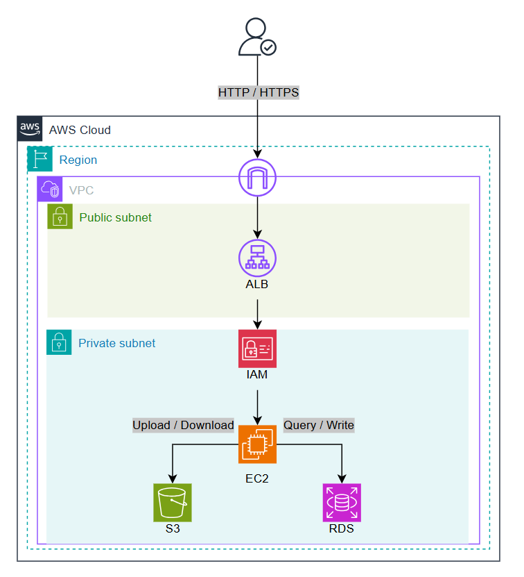

# 期末分組作品企畫書

## 1. 作品題目
**OmniDrop - 雲端檔案交換與訪客上傳服務 (Cloud-based File Exchange Service)**

## 2. 組員名單
* 賴政宏 411630428
* 蕭博文 411630758
* 翁濬緯 411630337

## 3. 動機
### 本架構用途
OmniDrop 是一套專為個人與小團隊設計的自架式檔案交換服務。核心特色在於「Dropzone」功能，允許管理員建立專屬的訪客上傳通道，讓外部協作者（如客戶、廠商）無須註冊帳號即可透過安全連結將檔案直接傳送至指定空間。此外，也提供具備密碼保護與到期設定的分享下載連結。

### 挑選理由
原本 OmniDrop 採用 Docker Compose 本地部署，在面對大量檔案傳輸或多位訪客同時上傳時，受限於單機硬體效能與儲存空間。透過 AWS 雲端服務，我們可以：
1.  **提升可靠性**：利用 RDS 託管資料庫，確保中繼資料的安全與自動備份。
2.  **無限儲存空間**：將檔案從本地目錄遷移至 S3，降低 EC2 磁碟負擔並節省成本。
3.  **高可用性**：透過 ALB 進行流量分發，未來可輕易擴展為多執行個體架構。
4.  **安全性**：將應用程式置於 VPC 私有子網路，僅透過 ALB 暴露服務，大幅強化資安。

### 所用 AWS 服務名稱
*   **VPC (Virtual Private Cloud)**：建立自定義網路環境，切分公有 (Public) 與私有 (Private) 子網路。
*   **EC2 (Elastic Compute Cloud)**：執行 PHP 7.4 + Apache Web 伺服器，處理核心程式邏輯。
*   **RDS (Relational Database Service)**：使用 MySQL 引擎存取使用者帳號、分享連結與檔案中繼資料。
*   **S3 (Simple Storage Service)**：作為主要的檔案儲存後端，取代原本的 `storage/` 本地目錄。
*   **ALB (Application Load Balancer)**：負責接收外部 HTTP/HTTPS 流量並轉發至 EC2。
*   **IAM (Identity and Access Management)**：設定 EC2 Instance Role，確保 Web 伺服器能安全地存取 S3 儲存桶。

## 4. 雲服務架構圖

### 架構描述
1.  **網路環境 (VPC)**：
    *   **公有子網路 (Public Subnet)**：部署 Internet Gateway 與 ALB，作為外部流量入口。
    *   **私有子網路 (Private Subnet)**：部署 EC2 執行個體與 RDS 資料庫，確保主機不直接暴露於公網。
2.  **流量路徑**：使用者經由網際網路連接至 **ALB**，ALB 根據監聽器規則將請求轉發至私有子網路中的 **EC2**。
3.  **資料儲存**：
    *   **EC2** 上的應用程式透過 PDO 連線至 **RDS (MySQL)** 讀取配置。
    *   當使用者上傳檔案時，EC2 呼叫 AWS SDK 將物件存入 **S3 Bucket**。
    *   下載檔案時，EC2 產生 S3 Pre-signed URL 或進行 Proxy 下載，確保 S3 權限不外流。

### 雲架構示意圖

---
*註：本企畫書內容係根據 OmniDrop 專案功能需求規劃，實際部署時可依 Learner Lab 額度進行細部參數調整。*
